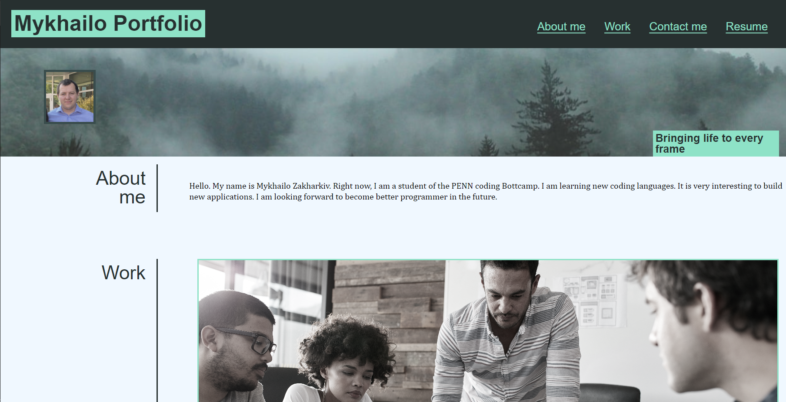
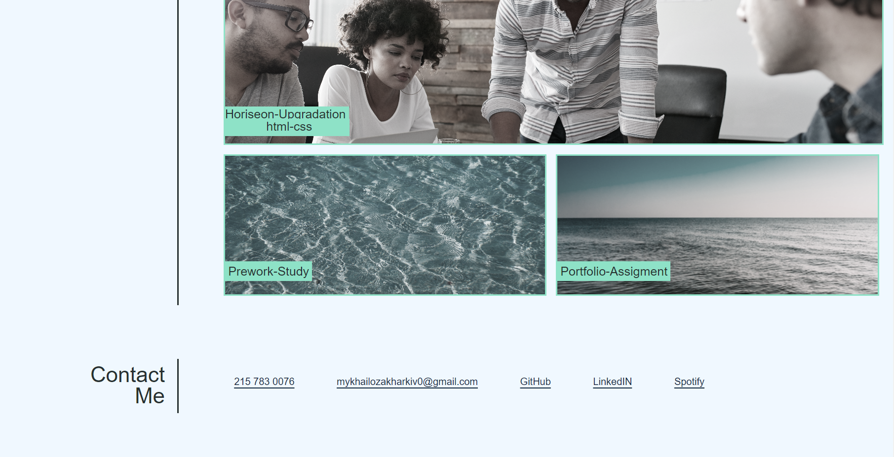

# Mykhailo-Portfolio

Making portfolio with my info and info of the projects I  did in the course.

## Description

I made a new website with my information and the work I have done during my PENN BootCamp. I wanted to present my information in responsive layout, also wanted to add some visual effects for My Work boxes. Also I wanted to make a work boxes that lead to the deployed web application after I click on them.

## Table of Contets

- [Screenshots](#screenshots)
- [Links](#links)

## Screenshots

In this section I provide screenshots of My Portfolio WebSite.

## Links

In this section I added links to the main project and to the GitHub repositorie with the codebase.

Deployed application
 https://mykhailozakh.github.io/Mykhailo-Portfolio/

Project Repository
 https://github.com/MykhailoZakh/Mykhailo-Portfolio
